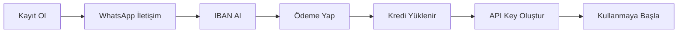

# 🚀 UcuzToken - AI API Gateway

[](https://ucuztoken.com)
[](https://api.ucuztoken.com/v1)
[](https://ucuztoken.com)

> **Uygun Fiyatlı AI API Erişimi** - Claude, GPT ve Gemini API'lerine limitisiz erişim

[English Documentation](#english) | [Türkçe Dokümantasyon](#türkçe)

---

## 🇹🇷 Türkçe

### 📖 Genel Bakış

UcuzToken, yapay zeka API'lerine (Claude, GPT, Gemini) uygun fiyatlı ve limitisiz erişim sağlayan bir API gateway servisidir. Kullanıcılar tek bir token havuzundan istedikleri kadar API key oluşturabilir ve kullanabilirler.

### ✨ Özellikler

- **💰 Uygun Fiyat**: 250 TL = $100 token kredisi
- **🔄 Limitisiz Kullanım**: Satın aldığınız kredi bitene kadar sınırsız kullanım
- **🚫 Kota Yok**: Rate limiting veya günlük/aylık kota yok
- **🔑 Çoklu API Key**: Tek hesaptan istediğiniz kadar API key oluşturun
- **🌐 Üç Platform**: Claude Code, GPT ve Gemini API'lerine erişim
- **💬 7/24 Destek**: WhatsApp üzerinden kesintisiz destek
- **⚡ Hızlı Aktivasyon**: Ödeme sonrası anında kredi yükleme

### 🎯 Nasıl Çalışır?



### 📋 Kullanım Adımları

1. **Kayıt Olun**
   - [ucuztoken.com](https://ucuztoken.com) adresinden kayıt olun
   - Telefon numaranızı girin

2. **İletişime Geçin**
   - WhatsApp üzerinden iletişime geçin
   - IBAN bilgisi alın

3. **Ödeme Yapın**
   - 250 TL'yi belirtilen IBAN'a gönderin
   - Dekont/makbuz gönderin

4. **Kredi Yüklenmesi**
   - Ödemeniz onaylandıktan sonra hesabınıza $100 kredi yüklenir

5. **API Key Oluşturun**
   - Dashboard'dan istediğiniz kadar API key oluşturun
   - Tüm key'ler aynı havuzdan kredi kullanır

6. **Kullanmaya Başlayın**
   - API key'lerinizi uygulamalarınızda kullanın

### 🔌 API Kullanımı

**Base URL**: `https://api.ucuztoken.com/v1`

#### Claude API Örneği

```bash
curl https://api.ucuztoken.com/v1/messages \
  -H "Content-Type: application/json" \
  -H "X-API-Key: YOUR_API_KEY" \
  -H "anthropic-version: 2023-06-01" \
  -d '{
    "model": "claude-3-5-sonnet-20241022",
    "max_tokens": 1024,
    "messages": [
      {"role": "user", "content": "Merhaba!"}
    ]
  }'
```

#### GPT API Örneği

```bash
curl https://api.ucuztoken.com/v1/chat/completions \
  -H "Content-Type: application/json" \
  -H "Authorization: Bearer YOUR_API_KEY" \
  -d '{
    "model": "gpt-4",
    "messages": [
      {"role": "user", "content": "Merhaba!"}
    ]
  }'
```

#### Gemini API Örneği

```bash
curl https://api.ucuztoken.com/v1/models/gemini-pro:generateContent \
  -H "Content-Type: application/json" \
  -H "X-API-Key: YOUR_API_KEY" \
  -d '{
    "contents": [{
      "parts": [{"text": "Merhaba!"}]
    }]
  }'
```

### 💻 Kod Örnekleri

#### Python (Claude)

```python
import anthropic

client = anthropic.Anthropic(
    api_key="YOUR_API_KEY",
    base_url="https://api.ucuztoken.com/v1"
)

message = client.messages.create(
    model="claude-3-5-sonnet-20241022",
    max_tokens=1024,
    messages=[
        {"role": "user", "content": "Merhaba!"}
    ]
)
print(message.content)
```

#### JavaScript (GPT)

```javascript
import OpenAI from 'openai';

const openai = new OpenAI({
  apiKey: 'YOUR_API_KEY',
  baseURL: 'https://api.ucuztoken.com/v1'
});

const completion = await openai.chat.completions.create({
  model: "gpt-4",
  messages: [
    { role: "user", content: "Merhaba!" }
  ]
});

console.log(completion.choices[0].message);
```

#### Python (Gemini)

```python
import google.generativeai as genai

genai.configure(
    api_key="YOUR_API_KEY",
    transport="rest",
    client_options={"api_endpoint": "https://api.ucuztoken.com/v1"}
)

model = genai.GenerativeModel('gemini-pro')
response = model.generate_content("Merhaba!")
print(response.text)
```

### 💳 Fiyatlandırma

| Paket | Fiyat (TL) | Kredi ($) | Özellikler |
|-------|------------|-----------|------------|
| Başlangıç | 250 TL | $100 | Limitisiz kullanım, kota yok, 7/24 destek |

### 📞 İletişim

- **Website**: [ucuztoken.com](https://ucuztoken.com)
- **Destek**: WhatsApp (7/24)
- **API Endpoint**: `https://api.ucuztoken.com/v1`

### ❓ Sık Sorulan Sorular

**S: Kullanım limiti var mı?**  
C: Hayır, satın aldığınız kredi bitene kadar sınırsız kullanabilirsiniz.

**S: Kaç tane API key oluşturabilirim?**  
C: İstediğiniz kadar. Tüm key'ler aynı kredi havuzundan kullanır.

**S: Kredim ne zaman biter?**  
C: API kullanımınıza bağlı olarak. Dashboard'dan anlık bakiyenizi görebilirsiniz.

**S: Hangi modelleri kullanabilirim?**  
C: Claude (tüm versiyonlar), GPT-3.5, GPT-4, Gemini Pro ve diğer Google AI modelleri.

**S: Ödeme sonrası ne kadar sürede kredi yüklenir?**  
C: Dekont gönderildikten sonra genellikle 5-30 dakika içinde.

---

## 🇬🇧 English

### 📖 Overview

UcuzToken is an AI API gateway service providing affordable and unlimited access to AI APIs (Claude, GPT, Gemini). Users can create unlimited API keys from a single token pool.

### ✨ Features

- **💰 Affordable Pricing**: 250 TRY = $100 token credit
- **🔄 Unlimited Usage**: No limits until your credit runs out
- **🚫 No Quotas**: No rate limiting or daily/monthly quotas
- **🔑 Multiple API Keys**: Create as many API keys as you need
- **🌐 Three Platforms**: Access to Claude Code, GPT, and Gemini APIs
- **💬 24/7 Support**: Continuous support via WhatsApp
- **⚡ Fast Activation**: Instant credit loading after payment

### 🎯 How It Works?


### 📋 Usage Steps

1. **Sign Up**
   - Register at [ucuztoken.com](https://ucuztoken.com)
   - Enter your phone number

2. **Contact**
   - Contact via WhatsApp
   - Receive IBAN information

3. **Make Payment**
   - Send 250 TRY to the provided IBAN
   - Send payment receipt

4. **Credit Loading**
   - After payment confirmation, $100 credit is added to your account

5. **Create API Keys**
   - Create unlimited API keys from your dashboard
   - All keys use credit from the same pool

6. **Start Using**
   - Use your API keys in your applications

### 🔌 API Usage

**Base URL**: `https://api.ucuztoken.com/v1`

#### Claude API Example

```bash
curl https://api.ucuztoken.com/v1/messages \
  -H "Content-Type: application/json" \
  -H "X-API-Key: YOUR_API_KEY" \
  -H "anthropic-version: 2023-06-01" \
  -d '{
    "model": "claude-3-5-sonnet-20241022",
    "max_tokens": 1024,
    "messages": [
      {"role": "user", "content": "Hello!"}
    ]
  }'
```

#### GPT API Example

```bash
curl https://api.ucuztoken.com/v1/chat/completions \
  -H "Content-Type: application/json" \
  -H "Authorization: Bearer YOUR_API_KEY" \
  -d '{
    "model": "gpt-4",
    "messages": [
      {"role": "user", "content": "Hello!"}
    ]
  }'
```

#### Gemini API Example

```bash
curl https://api.ucuztoken.com/v1/models/gemini-pro:generateContent \
  -H "Content-Type: application/json" \
  -H "X-API-Key: YOUR_API_KEY" \
  -d '{
    "contents": [{
      "parts": [{"text": "Hello!"}]
    }]
  }'
```

### 💻 Code Examples

#### Python (Claude)

```python
import anthropic

client = anthropic.Anthropic(
    api_key="YOUR_API_KEY",
    base_url="https://api.ucuztoken.com/v1"
)

message = client.messages.create(
    model="claude-3-5-sonnet-20241022",
    max_tokens=1024,
    messages=[
        {"role": "user", "content": "Hello!"}
    ]
)
print(message.content)
```

#### JavaScript (GPT)

```javascript
import OpenAI from 'openai';

const openai = new OpenAI({
  apiKey: 'YOUR_API_KEY',
  baseURL: 'https://api.ucuztoken.com/v1'
});

const completion = await openai.chat.completions.create({
  model: "gpt-4",
  messages: [
    { role: "user", content: "Hello!" }
  ]
});

console.log(completion.choices[0].message);
```

#### Python (Gemini)

```python
import google.generativeai as genai

genai.configure(
    api_key="YOUR_API_KEY",
    transport="rest",
    client_options={"api_endpoint": "https://api.ucuztoken.com/v1"}
)

model = genai.GenerativeModel('gemini-pro')
response = model.generate_content("Hello!")
print(response.text)
```

### 💳 Pricing

| Package | Price (TRY) | Credit ($) | Features |
|---------|-------------|------------|----------|
| Starter | 250 TRY | $100 | Unlimited usage, no quotas, 24/7 support |

### 📞 Contact

- **Website**: [ucuztoken.com](https://ucuztoken.com)
- **Support**: WhatsApp (24/7)
- **API Endpoint**: `https://api.ucuztoken.com/v1`

### ❓ FAQ

**Q: Are there usage limits?**  
A: No, you can use unlimited until your credit runs out.

**Q: How many API keys can I create?**  
A: As many as you want. All keys use credit from the same pool.

**Q: When does my credit expire?**  
A: Depends on your API usage. You can check your balance in the dashboard.

**Q: Which models can I use?**  
A: Claude (all versions), GPT-3.5, GPT-4, Gemini Pro, and other Google AI models.

**Q: How long does credit loading take after payment?**  
A: Usually 5-30 minutes after receipt is sent.

---

## 📄 License

© 2024 UcuzToken. All rights reserved.

## 🤝 Contributing

This is a commercial service documentation. For support, please contact via WhatsApp.

## ⚠️ Disclaimer

UcuzToken is an independent API gateway service. We are not affiliated with Anthropic, OpenAI, or Google.
